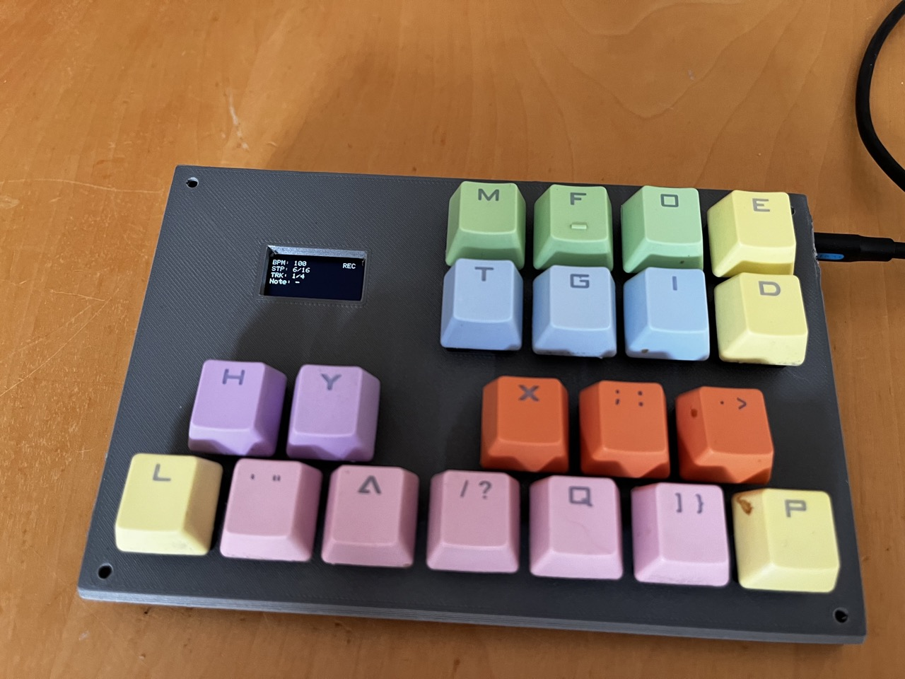
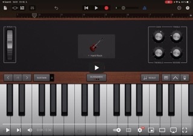

# Pi Pico based Step Sequencer

## Introduction

Goal of this project is to provide a functional step sequencer, that would be relatively portable, easy to use and fully hackable.

## Version 0

Version 0 is an experimental prototype with a hand wired keyboard matrix and display, not great but it works pretty well.

### Demo of USB MIDI going to GarageBand on an ipad

### Hardware

* Raspberry Pi Pico
* 20 keyboard switched
* I2C SSD1306 display
* Midi connector
* Misc
    * Wire
    * Diodes
    * Resistors (10ohm and 33ohm)

### Firmware

The newest version of the firmware is src/main_v2.py, I decided to rewrite the firmware to utilize coroutines and improve performance. There was severe performance degradation while writing to the display, so display is now essentially disabled while in play mode and step mode is recommended for editing. The sequencer was tested with E1M1 (also default pattern 1) and it was able to believably reproduce it using usb midi and garageband. Hardware midi was tested with Behringer Model D.

### Controls

#### Modes

##### Play mode

Default mode when the sequencer starts up, the keyboard can be played as a midi instrument and programmed sequences are played. No sequence programming is performed.

##### Record mode

The keyboard programmes notes into the sequence.

##### Step mode

Can be activated in both PLAY and RECORD modes. In play mode, it pauses playback. If activated in record mode, automatic sequence advance and stepping is performed manually.

#### Control layout

There are eight function button numbered from top left 1, 2, 3, 4 on the first rown and 5, 6, 7, 8 on the second row.

() - with modifier 1
[] - with modifier 2

The other keys are one octave of piano keys.

##### Play mode

* 1: Enter or exit record mode, disable step mode
* 2: Enter step mode, next step in step mode
* 3: (Steps per beat)
* 4: Tempo +, (octave +), [midi channel +]
* 5: Modifier 1
* 6: Modifier 2
* 7: RESERVED FOR FUTURE: 5x Tempo +/- 
* 8: Tempo -, (octave -), [midi channel -]

##### Record mode:

* 1: Enter or exit record mode, disable step mode
* 2: Enter step mode, next step in step mode
* 3: Note length - 1/n, (Steps per beat)
* 4: Track +, (octave +), [midi channel +]
* 5: Modifier 1
* 6: Modifier 2
* 7: note mode - one note, double note, triple note
* 8: Track -, (octave -), [midi channel -]

## TODO:
* Improve readme
* Create schematic
* Create control layout scheme that is readable
* Design a PCB
    * Cheaper variant with nice tactile smd buttons
    * Fancy variant with cherry mx buttons
    * A variant with touch keys???
* Provide a way for people to buy a kit
* Provide limited amount of prebuilt kits (I will have to figure out the logistics of this one)
* Update case and model case lid

## Planned additional features:
* CV + Gate out for 1 or 2 tracks
* Sync IN/OUT (Simple enough, hopefully)
* Save/Load
* Track length/count configuration
* Track patterning???
* Port firmware to C or Rust (rust has nice async/await, etc...) using the pico sdk - after final hardware and stable circuitpython firmware
* Different screen
    * Bigger to improve readability
    * Faster to remove the ssd1306 bottleneck
    * [Candidate](https://www.aliexpress.com/item/1005004726017957.html?spm=a2g0o.productlist.main.1.73256cc5ZJRNvi&algo_pvid=fc51ccc0-c17f-4f8f-9461-e13a99c78fd2&algo_exp_id=fc51ccc0-c17f-4f8f-9461-e13a99c78fd2-0&pdp_ext_f=%7B%22sku_id%22%3A%2212000030244707593%22%7D&pdp_npi=3%40dis%21USD%214.34%213.82%21%21%21%21%21%402100bbf516785644742137121d06f5%2112000030244707593%21sea%21CZ%21740805232&curPageLogUid=Dx2WB20pU3aQ)
